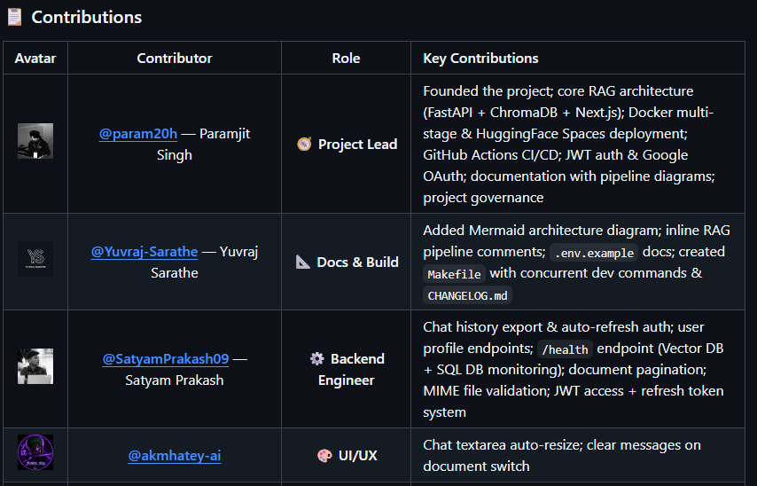

# Open Source Guestbook - Contributor & Developer Guide

Welcome to the **Open Source Guestbook Board**! This is a collaborative developer dashboard built with **Next.js 16 (Turbopack)**, **Tailwind CSS**, and **Firebase (Firestore + Analytics)**. 

The goal of this project is to provide junior and learning developers with a safe, live playground to practice their **Git branching, open-source pull requests, and creative frontend design skills**.

---

## 📌 Project Overview & Concept

Instead of a generic text list, this guestbook is styled as an interactive **Whiteboard Grid** of contributor cards. 
- Lead maintainer **Uthkarsh Mandloi** has styled his card as a premium **sports/gaming trading card** with custom SVG badges, holographic hover sheens, and an **interactive hover-swipe panel** that slides up to show advanced GitHub stats.
- **Your Creative Freedom**: Contributors have 100% style and layout freedom! You do **not** have to follow a rigid Neo-Pop or Neo-Brutalist design. You can design standard cards, gaming cards, 3D card flips, interactive terminal designs, or custom animated frames.

---

## 🚀 Key Features

1. **Whiteboard Grid (`app/page.tsx`)**:
   - Loops through a central registry file and dynamically imports each contributor's custom React card.
   - Built with CSS grid set to `items-start` vertical alignment. Taller interactive/custom cards and shorter cards sit side-by-side without stretching or distorting each other's custom dimensions.
   - Animated quick-link slider at the top for profile pages.
2. **Interactive Stats Cards**:
   - Cards support interactive hover states, including 3D tilt adjustments, holographic reflective shines, and sliding overlays to swap graphics for live statistic summaries.
3. **Dynamic Contributor Profiles (`app/profile/[username]/page.tsx`)**:
   - If you only make a card, clicking it will automatically query the GitHub API to fetch your avatar, bio, and repositories in a dynamic fallback layout.
   - If you build a custom profile component, the page will render your bespoke profile page (such as Uthkarsh's custom-themed galaxy deck).
4. **Ratings & Feedback Board (`components/RatingSection.tsx`)**:
   - Dynamic rating stars (1-5) and feedback submission forms connected to Cloud Firestore. 
   - Ratings are aggregated in real-time to compute average score ranks.
5. **Score Leaderboard (`app/leaderboard/page.tsx`)**:
   - Reads the Firestore database, aggregates scores, and ranks contributors dynamically on a podium page with custom badges.
6. **Badge Card Generator (`app/get-card/page.tsx`)**:
   - A generator preview mock demonstrating integration with a secure backend API card creator (currently configured with a blur overlay).

---

## 🛠️ Folder Structure Reference

```bash
open-source-guestbook/
├── app/
│   ├── get-card/        # Badge Generator page
│   ├── leaderboard/     # Leaderboard page
│   └── profile/
│       └── [username]/  # Dynamic profile router
├── components/
│   ├── user-card/       # 📂 Place your custom Card component here
│   │   ├── TemplateCard.tsx
│   │   └── UthkarshCard.tsx
│   ├── user-page/       # 📂 Place your custom Profile page component here
│   │   ├── TemplateProfile.tsx
│   │   └── UthkarshProfile.tsx
│   ├── Icons.tsx        # Standard brand SVGs (preventing compile warnings)
│   └── registry.ts      # 📄 The centralized contributor index
└── lib/
    └── firebase.ts      # Firebase init & CRUD database helpers
```

---

## 🧑‍💻 How to Connect Your Card & Profile

Follow these steps to code your custom components and register them in the system. If you are using an **AI coding agent**, share these instructions directly with it!

### Step 1: Create Your Custom Card
1. Open the folder `components/user-card/`.
2. Duplicate `TemplateCard.tsx` and rename it to `<YourGitHubUsername>Card.tsx` (e.g. `JaneDoeCard.tsx`).
3. Inside, rename the function to match the filename (e.g., `export function JaneDoeCard()`).
4. Design your card component! You can use custom Tailwind styling, Lucide React icons, and custom transitions.
   - 🚨 **CRITICAL RULE**: Do **NOT** put any image files in the local `public/` directory to keep the repository small. Fetch images from your GitHub profile (`https://github.com/<username>.png`) or use an external URL.

### Step 2: Create Your Custom Profile Page (Optional)
1. If you want a custom profile page instead of the default layout when users click your card, open `components/user-page/`.
2. Duplicate `TemplateProfile.tsx` and rename it to `<YourGitHubUsername>Profile.tsx` (e.g. `JaneDoeProfile.tsx`).
3. Rename the function to match the filename (e.g., `export function JaneDoeProfile()`).
4. Custom style your profile page section. You can embed your custom card here or make interactive project panels.

### Step 3: Register Yourself in the Central Index
1. Open `components/registry.ts`.
2. Import your Card (and optional Profile page) at the top:
   ```typescript
   import { JaneDoeCard } from "./user-card/JaneDoeCard";
   import { JaneDoeProfile } from "./user-page/JaneDoeProfile"; // if created
   ```
3. Add your details to the `contributors` array:
   ```typescript
   {
     username: "janedoe",              // URL slug: /profile/janedoe
     name: "Jane Doe",                 // Display name
     gitUsername: "janedoe-git",       // GitHub Username
     cardColor: "#FF99B2",             // Accent highlight color
     cardComponent: JaneDoeCard,       // Your custom Card component
     pageComponent: JaneDoeProfile,    // Your custom Page (optional, omit for default GitHub stats layout)
   }
   ```

### Step 4: Verify Your Connections Locally
1. Start the dev server: `npm run dev` and open `http://localhost:3000`.
2. Verify that:
   - Your card appears in the grid on the **Home Page Whiteboard**.
   - Your card fits properly without stretching or shifting other cards.
   - Clicking your card correctly routes you to your profile page (`/profile/janedoe`).
   - If you created a custom profile page, your design displays correctly. If not, the default GitHub statistics dashboard loads your avatar, repositories, and biography successfully.
3. Build the project using `npm run build` to confirm there are no syntax or TypeScript warnings before pushing.

---

## 🔒 Firebase Configuration (For Maintainers)
If you are running the guestbook locally, add your Firebase credentials to a `.env.local` file in the root directory:
```env
NEXT_PUBLIC_FIREBASE_API_KEY=your_api_key
NEXT_PUBLIC_FIREBASE_AUTH_DOMAIN=your_auth_domain
NEXT_PUBLIC_FIREBASE_PROJECT_ID=your_project_id
NEXT_PUBLIC_FIREBASE_STORAGE_BUCKET=your_storage_bucket
NEXT_PUBLIC_FIREBASE_MESSAGING_SENDER_ID=your_sender_id
NEXT_PUBLIC_FIREBASE_APP_ID=your_app_id
NEXT_PUBLIC_FIREBASE_MEASUREMENT_ID=your_measurement_id
```
Ensure your Firestore database rules allow reading and writing to the `reviews` collection:
```javascript
rules_version = '2';
service cloud.firestore {
  match /databases/{database}/documents {
    match /reviews/{document} {
      allow read, write: if true;
    }
  }
}
```

---

## Contributions & Merged Submissions

Below is the list of active developers whose cards and pages have been successfully merged into the whiteboard board!



<!-- Scrollable Contributor Container -->
<div style="max-height: 280px; overflow-y: auto; border: 1px solid rgba(0,0,0,0.15); border-radius: 12px; padding: 12px;">

| Avatar | Contributor | Role | Key Contributions |
| :---: | :--- | :---: | :--- |
|  | [@UthkarshMandloi](https://github.com/UthkarshMandloi) - Uthkarsh Mandloi | Project Lead / Creator | Founded the guestbook project; core layout architecture; Firebase rating system & Dynamic profile rendering integration. |
|  | [@johndoe-git](https://github.com/johndoe-git) - John Doe | Junior Dev | Added beginner template components (`TemplateCard` / `TemplateProfile`) and documentation guides. |

</div>

*Once your pull request is approved and merged, you can add your name, github handle, avatar, and contribution details to this list!*
