# 🚀 Open Source Guestbook Board

```text
 ██████  ██████  ███████ ███    ██      ██████  ██    ██ ███████ ███████ ████████ ██████   ██████   ██████  ██   ██ 
██    ██ ██   ██ ██      ████   ██     ██       ██    ██ ██      ██         ██    ██   ██ ██    ██ ██    ██ ██  ██  
██    ██ ██████  █████   ██ ██  ██     ██   ███ ██    ██ █████   ███████    ██    ██████  ██    ██ ██    ██ █████   
██    ██ ██      ██      ██  ██ ██     ██    ██ ██    ██ ██           ██    ██    ██   ██ ██    ██ ██    ██ ██  ██  
 ██████  ██      ███████ ██   ████      ██████   ██████  ███████ ███████    ██    ██████   ██████   ██████  ██   ██ 
```

🔗 **Live Website**: [open-source-guestbook.vercel.app](https://open-source-guestbook.vercel.app/)

Welcome! This repository is built specifically to teach you how the **Open Source Workflow** operates in the real world. 

If you are a beginner looking to make your first pull request, you are in the right place! This repository hosts a live, collaborative developer board. By following the workflow below, you will practice contributing to a real project by designing your own developer "Trading Card" and getting it merged into the live website.

---

## 🗺️ Comprehensive Guide to Contributing

To keep things organized and simulate a professional open-source environment, we follow a strict workflow. Do not just write code and submit it blindly, you must be assigned to an issue first!

### Phase 1: How to Claim and Get Assigned an Issue

**Step 1: Go to the Issues Tab**
Navigate to the top of this repository and click on the **Issues** tab.
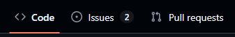

**Step 2: Select an Open Issue**
Browse the list of open issues. Look for ones tagged with `good first issue` (like adding your trading card to the board) and click on it.
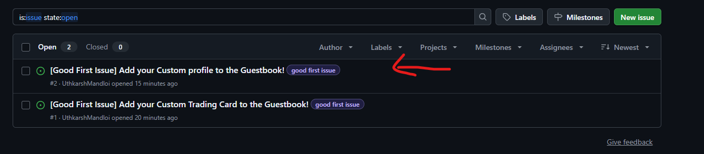

**Step 3: Read the Instructions Carefully**
Every issue has specific rules. Read the description thoroughly so you know exactly what is expected before you start coding.
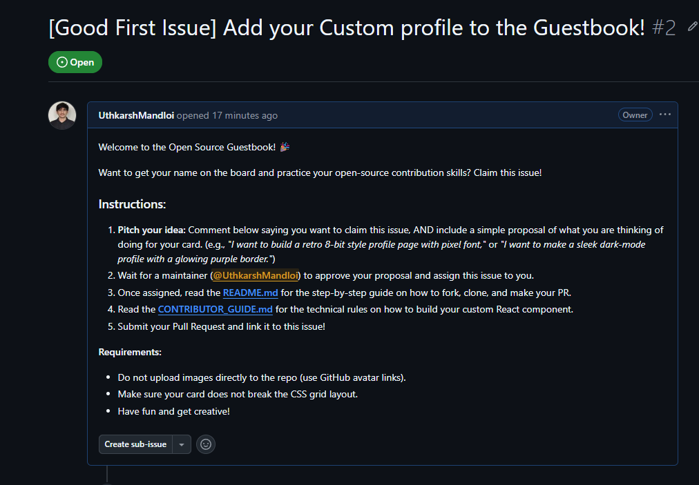

**Step 4: Submit Your Proposal**
Maintainers need to know your plan! Scroll down to the comment box. Write a short proposal of what you intend to do (e.g., *"I want to build a dark-mode card with neon green borders"*), and leave a comment to claim the issue.
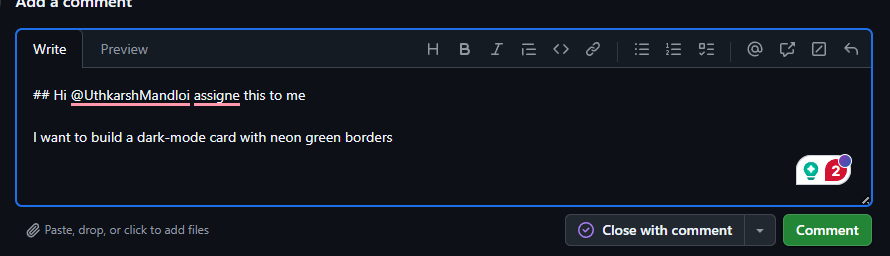

**Step 5: Wait to be Assigned**
Do not start coding yet! Wait for a maintainer (@UthkarshMandloi) to review your proposal. Once approved, they will officially assign the issue to you. You will receive a notification, and your profile picture will appear on the right side of the issue.

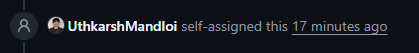
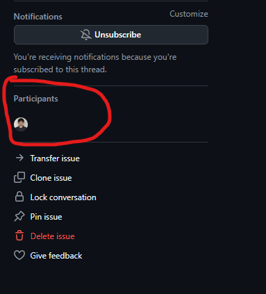

---

### Phase 2: The Technical Workflow 💻

Once you have been assigned the issue, it is time to start coding! This phase is divided into two parts: getting the code onto your computer, and submitting your finished work.

#### Part 1: How to Fork, Clone, and Branch

**Step 1: Fork the Repository**
You cannot edit the original code directly. You need to create a personal copy on your GitHub account. Click the **Fork** button at the top right of this page.
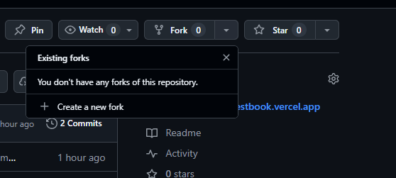

**Step 2: Get Your Clone Link**
Go to your GitHub profile and open your newly forked repository. Click the green **Code** button and copy the HTTPS URL.
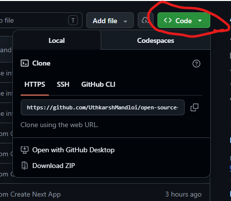

**Step 3: Clone the Repository to Your System**
Open your terminal and run the clone command using the link you just copied:
```bash
git clone https://github.com/<YOUR-USERNAME>/open-source-guestbook.git
```

**Step 4: Navigate into the Folder**
Move into the project directory:
```bash
cd open-source-guestbook
```

**Step 5: Add the Upstream Remote**
You need to link your local folder back to the original repository so you can pull any new updates that other people make. Run this command:
```bash
git remote add upstream https://github.com/UthkarshMandloi/open-source-guestbook.git
```
*Note*: To check if you did this correctly, run `git remote -v`. You should see `origin` (your fork) and `upstream` (the original repo).
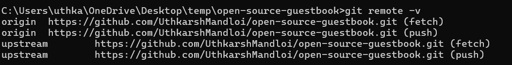

**Step 6: Create Your Feature Branch**
Never code on the dev or main branch! Create a new branch using the naming convention `username/feature-name` (e.g., `uthkarsh/dark-mode-card`):
```bash
git checkout -b your-username/your-feature
```

#### Part 2: How to Code, Push, and Create a Pull Request (PR)

**Step 1: Code and Keep Updated**
Now, open the code in your editor and build your card! (See [CONTRIBUTING.md](CONTRIBUTING.md) for the technical rules).

*Important Note*: If you are working for a few days, the original repository might change. Keep your branch updated by pulling from the upstream before you finish:
```bash
git pull upstream dev
```

**Step 2: Commit and Push to Your Fork**
Once your card is ready, save your changes, commit them, and push them to your branch on GitHub:
```bash
git add .
git commit -m "feat: added [Your Name] trading card"
git push origin your-username/your-feature
```

**Step 3: Create a Pull Request**
Go back to the original repository (UthkarshMandloi/open-source-guestbook) on GitHub. You will see a green banner asking you to "Compare & pull request" your newly pushed branch. Click it!
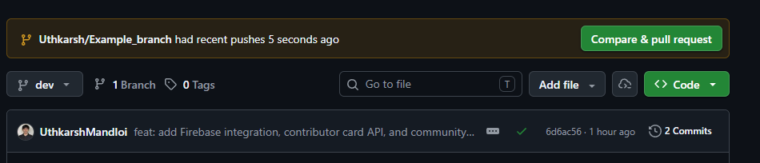

**Step 4: Attach the Issue and Write PR Details**
Give your PR a clear title. In the description box, you must link your PR to the issue you were assigned. Type `Closes #` followed by your issue number (e.g., `Closes #5`). This automatically links them together!
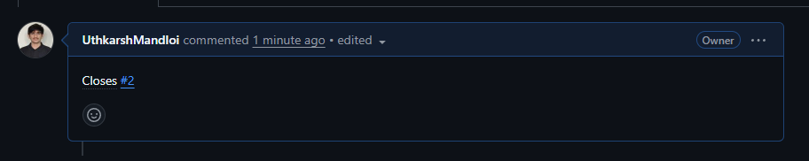


**Step 5: Submit and Verify Linking**
After completing your details, click the green **Create pull request** button to submit.
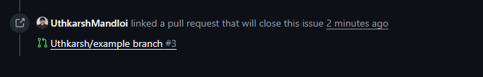

**Step 6: Review, Status Checks, and Merging**
Once your PR is submitted, it undergoes automatic checks (like compiling the Next.js project and checking for TypeScript types). It also requires manual approval from a maintainer before it is merged:
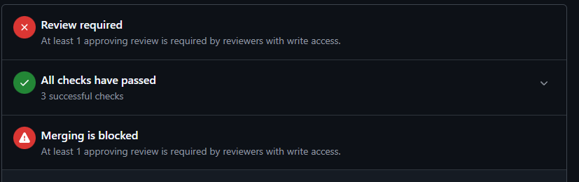
- **Review required / Merging is blocked**: This is completely normal! Pull requests require at least 1 approving review from the project maintainers with write access before they can be merged.
- **All checks have passed**: This means your code built cleanly without any syntax errors. 

---

🎉 **That's it! Your contribution process is complete.**
Wait for the maintainer to review your PR. If they request changes, make them locally, commit, and push again—the PR will update automatically. Once approved, your code will be merged and your card will go live on the site!

---

## 📖 Glossary for Learners

To help you get comfortable with open source, here is a glossary of the terms used in this workflow:

* **Fork**: A personal copy of another developer's project hosted on your own GitHub account. This allows you to make changes without affecting the original project.
* **Clone**: Downloading your git repository files from GitHub to your local computer so you can edit the code in your IDE.
* **Origin**: A default nickname for your personal, remote fork repository hosted on GitHub.
* **Upstream**: The nickname given to the original repository from which you forked (i.e., the central project database where final pull requests are merged).
* **Feature Branch**: A temporary branch created off the main code branch used to develop a single feature (like adding your card), preventing code contamination.
* **Pull Request (PR)**: A submission request to merge your branch changes into the upstream repository for review.
* **Merge Conflict**: When two developers make changes to the exact same lines of code in a file and merge them. Git gets confused about which change to keep, requiring you to manually select the correct code lines.

---

## 🐛 Bug Reports
If you encounter any bugs, please create a bug report as an issue in the **Issues** tab.

## 📬 Contact
To reach out, DM me on LinkedIn: [Uthkarsh Mandloi](https://www.linkedin.com/in/uthkarsh-mandloi-257531328)

---

## 📄 License
Distributed under the MIT License. See [LICENSE](LICENSE) for more information.

Built with 💙 as a flagship AI engineering project

If you found this project helpful, please give it a ⭐ — it helps contributors discover it!

FastAPI

[⬆ Back to top](#-open-source-guestbook-board)